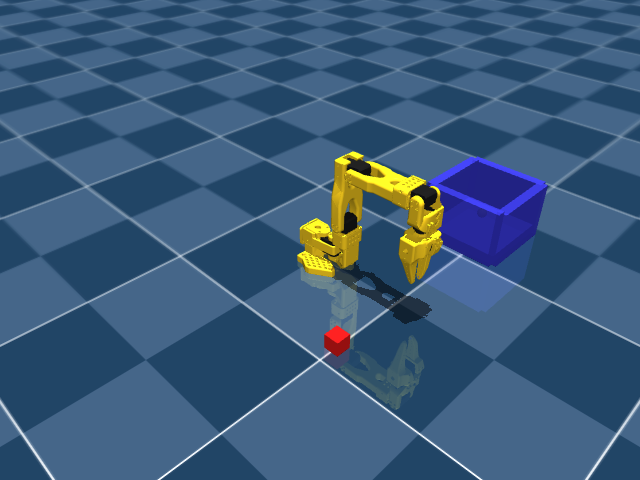
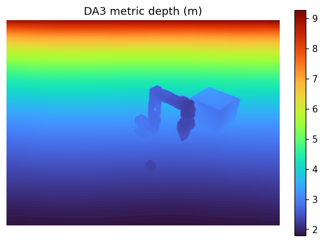
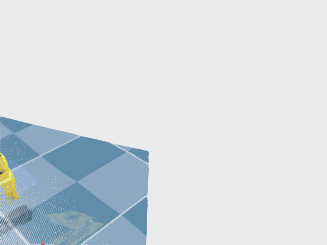
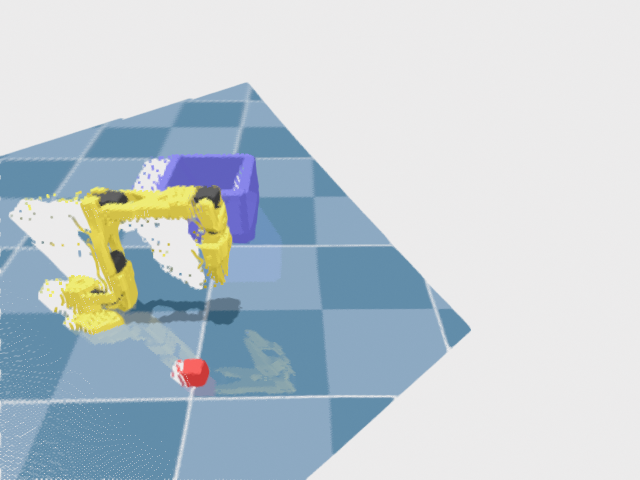
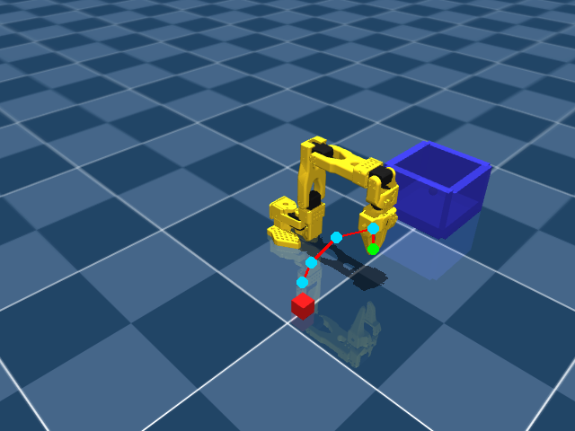

# Benchmark 4 report — DA3 point-cloud + RynnBrain iterative trajectory

Frame: `data/frames/pose_000.png` | gripper start px (415.4, 278.1) | target prompt: "red cube"

## Images

Original RGB (the only image RynnBrain sees first):



DA3 predicted metric depth:



Rendered point-cloud viewpoints (re-renders of the SAME monocular cloud, not new geometry -- see the caveat below):





## Trajectory refinement




## Metrics

```json
{
  "frame": "data/frames/pose_000.png",
  "endpoint_err_2d_px_initial": 20.8,
  "endpoint_err_2d_px_final": 26.1,
  "improvement_2d_px": -5.3,
  "endpoint_err_3d_mm_final": 1639.3,
  "pred_depth_m_at_endpoint": 2.5859,
  "gt_depth_m_at_endpoint": 0.9558,
  "path_length_px_per_stage": [
    134.8,
    129.4,
    129.4,
    129.4
  ],
  "endpoint_consistency_px_mean_step": 1.8,
  "n_refinement_stages": 3,
  "rynnbrain_model": "Alibaba-DAMO-Academy/RynnBrain1.1-2B",
  "depth_model": "depth-anything/DA3METRIC-LARGE"
}
```

## Raw trajectory per stage

- **initial**: 6 points, raw model text: `<trajectory> (649, 531), (585, 551), (541, 610), (525, 656), (525, 667) </trajectory>`
- **refine_1_bench4_02_render_left.png**: 5 points, raw model text: `<trajectory> (649, 579), (649, 531), (585, 551), (541, 610), (525, 656) </trajectory>`
- **refine_2_bench4_02_render_oblique45.png**: 5 points, raw model text: `<trajectory> (649, 579), (649, 531), (585, 551), (541, 610), (525, 656) </trajectory>`
- **refine_3_bench4_02_render_right.png**: 5 points, raw model text: `<trajectory> (649, 579), (649, 531), (585, 551), (541, 610), (525, 656) </trajectory>`

## Conclusion

Iterative multi-view point-cloud refinement did NOT improve the endpoint on this single frame (initial 20.8 px -> final 26.1 px from the true pixel; -5.3 px). **n=1 -- directional signal only, not a statistically powered claim; do not generalise from one frame.**

**Honest caveat (novel views of a monocular cloud):** the 3 "novel" viewpoints above are re-renders of ONE monocular point cloud -- they do not reveal any surface the original camera could not already see (front-facing points only, with holes at silhouettes and behind occluders). So this experiment tests whether re-rendered depth CUES from a different angle help RynnBrain reason about a fixed, already-known set of 3D points -- not whether genuinely new geometry (a second real camera, a wrist-mounted sensor) would help. A positive result here says "showing the same facts differently helps a VLA reason"; it is not evidence that multi-view re-rendering could substitute for real multi-camera triangulation.

**3D error confound:** the 3D world error lifts the predicted pixel through DA3's OWN metric depth (never ground truth) -- it is therefore a joint score of (trajectory endpoint accuracy) × (DA3 depth accuracy at that pixel), not trajectory accuracy alone. The 2D pixel error above isolates the trajectory-only signal; read the two together, not the 3D number in isolation.