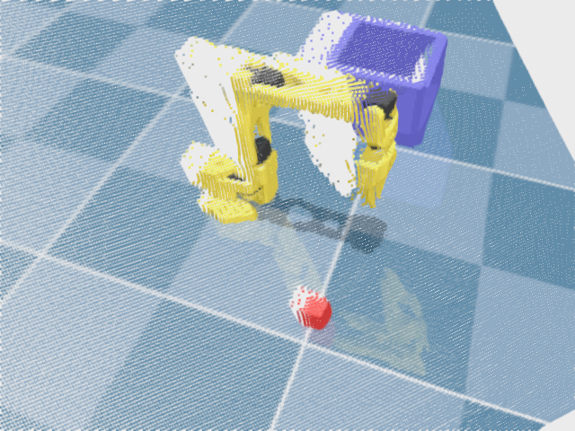
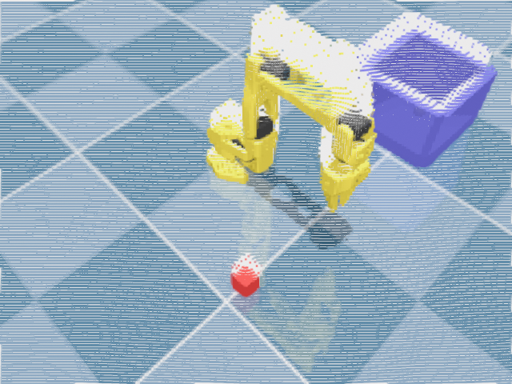
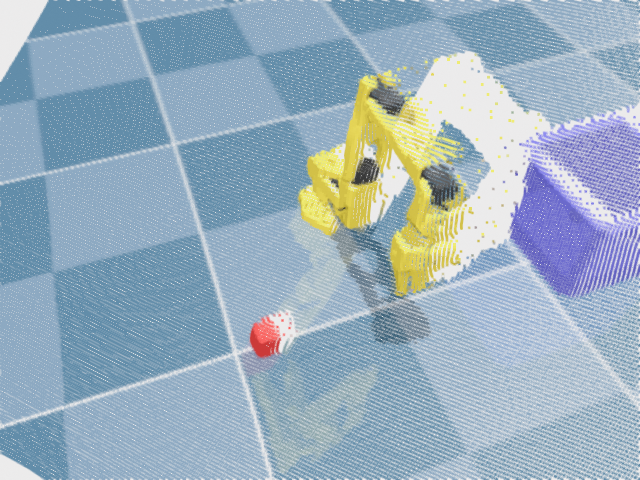
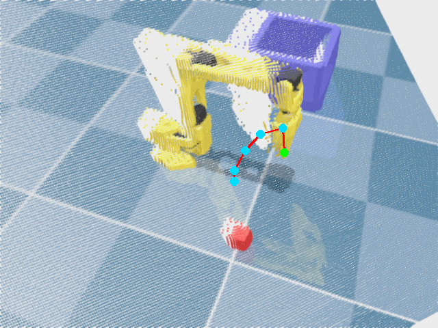
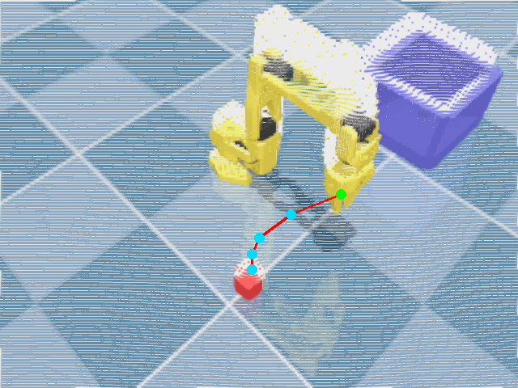
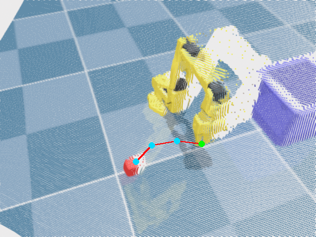

# Benchmark 4 report (v2) — calibrated DA3 point-cloud + RynnBrain multi-view triangulation

Frame: `data/frames/pose_000.png` | gripper start px (415.4, 278.1) | target prompt: "red cube"

## Depth calibration (§4A)

Robust inverse-depth affine fit: a=2.00099 b=0.198483 (193/376 anchors used after outlier rejection).
Gripper-pixel check: raw 2.481m -> calibrated 0.995m (true 0.995m).

## Images

Original RGB (the true side-cam view):


DA3 depth, calibrated:


Rendered point-cloud viewpoints (re-renders of the SAME calibrated monocular cloud, not new geometry -- see the caveat below):





## Per-view trajectories (each an INDEPENDENT prediction — no view was shown a previous answer)

**original** (given start px (415.4526647793912, 278.1546604655354), endpoint px (335.36, 325.92)):


**A_az110_el50** (given start px (415.94779688127613, 223.75917633175428), endpoint px (342.40000000000003, 265.44)):



**B_az135_el55** (given start px (421.92308631974504, 258.09262788278505), endpoint px (311.03999999999996, 333.59999999999997)):



**C_az160_el50** (given start px (408.57287790721443, 291.4834781895365), endpoint px (275.2, 327.84000000000003)):



## Triangulation

- Endpoint (grasp target) triangulated from views ['original', 'A_az110_el50', 'B_az135_el55', 'C_az160_el50']: `[0.1927, -0.1481, 0.0235]`, residual 0.00265 m, cond 0.01926143590258004, n_inliers 2/4
- Gripper-anchor self-consistency: triangulated the RAW start points RynnBrain actually drew (views ['original', 'A_az110_el50', 'B_az135_el55', 'C_az160_el50']) -> `[0.2376, -0.0193, 0.1375]`, vs the KNOWN gripper `[0.2321, -0.0002, 0.075]` -> **residual 65.6 mm**

## Metrics

```json
{
  "frame": "data/frames/pose_000.png",
  "endpoint_err_2d_px": 15.1,
  "endpoint_err_3d_mm": 16.3,
  "gripper_anchor_residual_mm": 65.6,
  "tri_residual_mm": 2.65,
  "tri_cond": 0.01926143590258004,
  "tri_n_inliers": 2,
  "tri_views_used": [
    "original",
    "A_az110_el50",
    "B_az135_el55",
    "C_az160_el50"
  ],
  "gripper_tri_residual_mm": 1.25,
  "gripper_tri_cond": 0.025217994034693665,
  "gripper_tri_views_used": [
    "original",
    "A_az110_el50",
    "B_az135_el55",
    "C_az160_el50"
  ],
  "per_view_endpoint_px": {
    "original": [
      335.4,
      325.9
    ],
    "A_az110_el50": [
      342.4,
      265.4
    ],
    "B_az135_el55": [
      311.0,
      333.6
    ],
    "C_az160_el50": [
      275.2,
      327.8
    ]
  },
  "depth_calibration": {
    "a": 2.0009944526977472,
    "b": 0.19848253616947234,
    "n_anchors_used": 193,
    "n_anchors_total": 376,
    "gripper_check_raw_m": 2.4805712699890137,
    "gripper_check_calibrated_m": 0.9948770403862,
    "gripper_check_true_m": 0.995
  },
  "rynnbrain_model": "Alibaba-DAMO-Academy/RynnBrain1.1-2B",
  "depth_model": "depth-anything/DA3METRIC-LARGE"
}
```

## Conclusion

Triangulated 3D endpoint error on this single frame: **16.3 mm** (vs v1's depth-lookup 1639.3mm). 2D endpoint error in the original view: **15.1 px**. Gripper-anchor self-consistency residual: **65.6 mm** — a LOW value here means the pose geometry and RynnBrain's per-view compliance are both trustworthy, so a large endpoint error would point at the target localisation itself rather than the pipeline plumbing; a HIGH value means the endpoint number is confounded by pipeline geometry error and should not be read at face value. **n=1 -- directional signal only, not a statistically powered claim; do not generalise from one frame.**

**Honest caveat (novel views of a monocular, now-calibrated cloud):** the 3 rendered viewpoints above are re-renders of ONE monocular point cloud -- they do not reveal any surface the original camera could not already see (front-facing points only, with holes at silhouettes and behind occluders). Calibrating the depth (§4A) fixes the cloud's ABSOLUTE SCALE, not this fundamental single-view coverage limit. So triangulating RynnBrain's per-view picks converts its 2D reasoning into a 3D estimate and AVERAGES OUT its per-view localisation noise/pose error — it cannot invent depth or geometry the calibrated cloud does not contain. This is exactly why the depth calibration in §4A is a prerequisite for this experiment to mean anything: triangulating over badly-scaled renders would still triangulate confidently to the wrong place. Read the gripper-anchor residual above as the honest bound on what this pipeline (pose geometry + calibration + RynnBrain compliance) can currently promise, independent of whether RynnBrain correctly identifies the target itself.